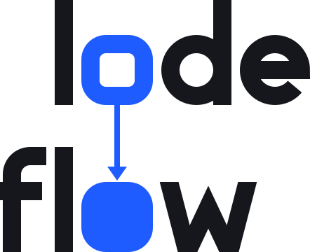
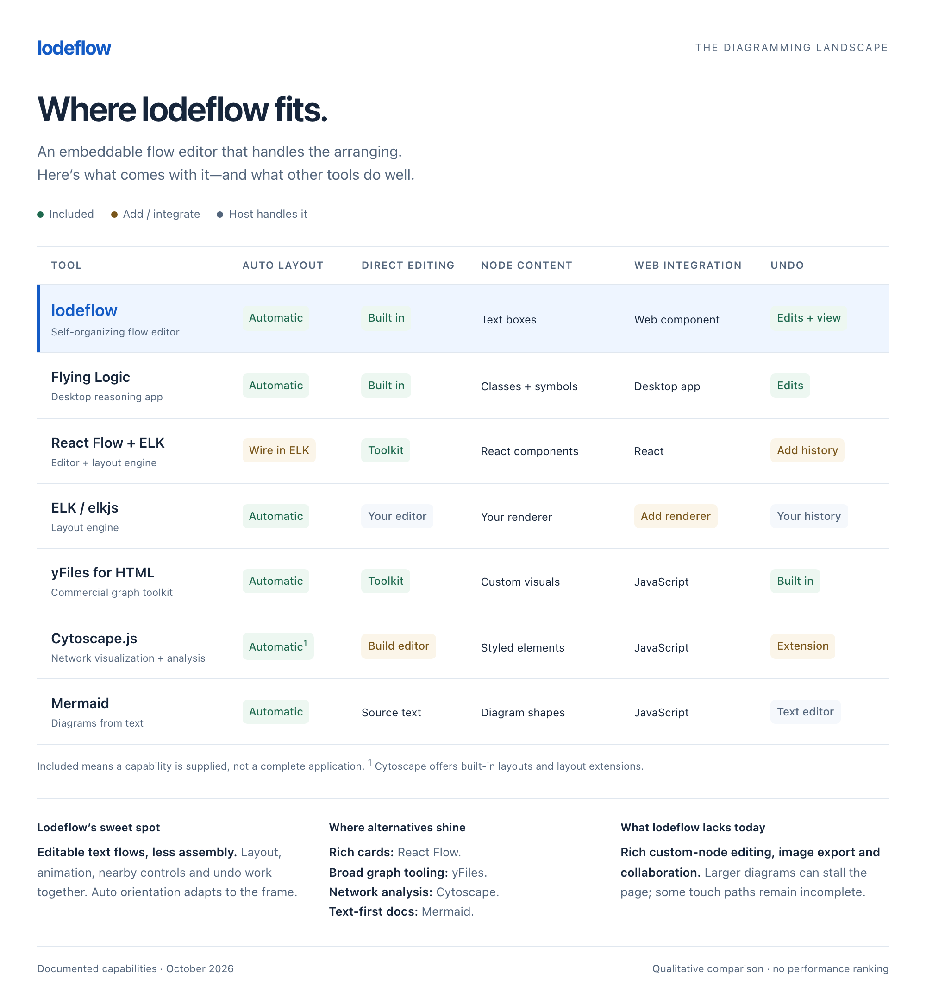

<h1><picture><source media="(prefers-color-scheme: dark)" srcset="site/logo-dark.svg"></picture></h1>

Self-organizing flow diagrams for the web. A Rust layout engine, compiled to WebAssembly, arranges the diagram by the ten Flying Logic layout rules. A framework-free `<lode-flow>` custom element draws it and animates every change. The same element works in React, Svelte and plain HTML.

You never place anything by hand. The diagram re-lays itself out after every edit and turns to fit its container, so it stays readable at any size.

[Try the live tutorial](https://clozach.github.io/lodeflow/) · [Source on GitHub](https://github.com/clozach/lodeflow)

The demo opens with two blank diagrams. Double-click the lower practice diagram or choose **Add node** to begin. The upper instruction diagram then reveals a level of gestures: try them yourself, or click the current step to run an example. Future steps unlock in order. Completed levels fold into groups; click a folded level to replay an earlier step. Your practice diagram remains fully editable, with its own undo history.

Open **?** inside the practice diagram for **Style** (Standard or Blueprint), the item count, **Restore tutorial**, and **Hard Reset**. Touch instructions omit keyboard shortcuts. Practice allows at most **100 items total** (nodes, edges, groups and junctions). Diagram, undo history and tutorial accomplishments stay in this browser’s localStorage; there are no accounts or edit requests. Accomplishments are saved against the practice revision and continue across undo and reload. **Restore tutorial** starts blank and is undoable. **Hard Reset** discards active typing and this version’s edits, history, accomplishments and appearance preference; it cannot be undone. Unrelated browser data and the previous demo version’s saved diagram remain intact. Blocked or full storage leaves the current session editable. Another tab’s saves are offered for explicit loading, preserving an unfinished draft.

## Compared with other tools



<details>
<summary>Comparison sources and scope</summary>

Documented capabilities reviewed October 6, 2026. Best-fit statements are qualitative judgments, not benchmark results or claims that other tools cannot support equivalent workflows. “Included” means the capability is supplied, not that a complete application needs no integration.

- Flying Logic: [interface and layout](https://docs.flyinglogic.com/user-guide/the-document-window.html), [undo](https://docs.flyinglogic.com/user-guide/menus.html), [graph logic](https://docs.flyinglogic.com/user-guide/graph-logic.html).
- React Flow: [layout integration](https://reactflow.dev/learn/layouting/layouting), [custom nodes](https://reactflow.dev/learn/customization/custom-nodes), [undo example](https://reactflow.dev/examples/interaction/undo-redo).
- ELK: [Layered layout](https://eclipse.dev/elk/reference/algorithms/org-eclipse-elk-layered.html), [elkjs](https://github.com/kieler/elkjs).
- yFiles: [layout toolkit](https://docs.yworks.com/yfiles-html/dguide/layout/index.html), [commercial distribution](https://docs.yworks.com/yfiles-html/dguide/yfiles_npm_module/).
- [Cytoscape.js](https://js.cytoscape.org/): layouts, styling, graph analysis and extensions.
- [Mermaid](https://mermaid.js.org/intro/): diagrams from text.
- Lodeflow: the implementation and API documented in this README.

</details>

## Run the tutorial locally

```sh
git clone https://github.com/clozach/lodeflow.git
cd lodeflow
corepack enable
pnpm --dir web install --frozen-lockfile
node scripts/dev-site.mjs 5207
```

Open `http://localhost:5207/`. Source changes rebuild and reload the preview automatically. For the static Pages output, run `pnpm --dir web build` followed by `node scripts/build-site.mjs`; serve `site/dist/` with any static HTTP server. The GitHub Actions workflow rebuilds the Rust/WASM engine, tests the component and tutorial, and publishes that directory on a push to `main`. The source includes a generated engine so local web development can begin without a Rust installation.

```
.
  engine/     Rust crate (no_std + alloc on wasm32): graph → ranks → order → coordinates → routes
  web/        TypeScript custom element, React wrapper, esbuild bundles in dist/
  examples/   standalone page, read-only embed, React and Svelte usage, sample diagram
  scripts/    builds, live tutorial preview, logo (build-logo.mjs draws site/logo*.svg and favicon.svg)
  site/       localStorage-only guided demo; built output in dist/
```

## The ten rules, as implemented

| # | Rule | Where |
|---|------|-------|
| 1 | You never position anything; the engine places every node and edge. | whole engine |
| 2 | One flow direction: left→right, right→left, top→bottom, bottom→top, or radial (inner→outer, outer→inner). `auto` picks whichever direction shows the text biggest in the current container. | `place.rs`, `relayout()` |
| 3 | Each entity sits downstream of everything that points into it. | `graph.rs` ranking |
| 4 | Bias: *Start* places each entity as early as its causes allow; *End* places it as late as its effects allow. | `graph.rs` ranking |
| 5 | Compactness (relaxed · comfortable · compact) sets the gaps between entities and between ranks. | `layout.rs` separations |
| 6 | An edge that closes a loop becomes a back edge. It is ignored for flow (the rest is laid out as if it were not there) and drawn dashed. The edge created last in a loop is the one that turns back, as in Flying Logic. | `graph.rs` acyclic pass |
| 7 | Groups keep their members together inside one box; nested groups nest; a collapsed group is laid out as a single node. | `order.rs`, `bk.rs` border chains |
| 8 | Full layout (default): every change lays out from scratch, minimising crossings. | `order.rs` sweeps |
| 9 | Incremental layout (optional): each layout starts from the previous left-to-right order; things move less, but the layout slowly gets less efficient. | `layout.rs` keys |
| 10 | Every change animates from the old layout to the new one (and respects reduced motion). | `draw()` |

The algorithm is a layered (Sugiyama-style) layout: loop breaking in creation order, longest-path ranks with start/end bias, long edges split into bend points, barycentre sweeps with group-contiguity constraints, Brandes–Köpf coordinates in which group borders always win, S-curve routes with fanned ports, and a polar mapping for radial flows.

Crossing reduction runs the barycentre sweeps from several starting orders (12 for small diagrams, fewer as they grow) and keeps the best. It scores a line crossing a line at 3 and a line crossing a group's outline at 2, so one crossing is preferred over a line cutting through a box.

Three options sit on top of the rules, the first two on by default:

- **Tight groups** (`T`) moves a group member with room to move toward the rest of its group after ranking, so boxes lose their empty bands. It never breaks rule 3 and never adds a rank.
- **Untangle** (`U`). Sometimes no ordering of the ranks can avoid a crossing; then the ranks themselves must change. Untangle tries each node that has room to move (a cause that could come later, an end effect, a group member) at either end of its room. It keeps a move only if the crossing cost falls and no crossing line is added, preferring moves that keep groups tight, and repeats. Bias and tight groups give way only to remove crossings. Its search has a budget: dozens of tries for a small diagram and a handful for a large one, capped by the work they cost in layout vertices (nodes plus bend points), so it tapers off and stops by about 250 flow-like nodes. It adds about 4 ms at 30 nodes and up to about 10 ms at 100–250. **Edge labels** ride their edge's middle bend point, which takes the label's size, so the same separation rules keep labels clear of nodes, groups and each other; an edge spanning one rank is lengthened to two to make room.

## Links, merges and labels

- **Link two nodes**: drag from one node to another with a mouse, or select a node and press `E` (or *Link* on its controls) for a list of every node, then every edge, each nearest-to-furthest. Type to filter; `↑` `↓` choose; `↵` links; the list stays open (with a receipt and *Undo*) so you can link again; `Esc` closes it. To link several at once, check rows first: `⌘`/`Ctrl`-click (or a click on a row's box, which touch can use) checks one more, `⇧`-click checks every row between it and the last one checked, `⌘↵`/`Ctrl+Enter` and `⇧↓`/`⇧↑` do the same from the keys; a bar then reads *N checked · Link ↵ · Uncheck*, and `↵` or a click on another row links them all (plus that row) in one undo step. `⇧E` (or ⇧-click on *Link*) turns the list around: pick a node to link *into* the selected one (nodes only, leaving out those already linked into it). On touch the list is the way to link: one-finger drags always pan.
- **Merge into an edge**: drop a link on an edge (or pick an edge in the list). The node joins it as another cause: the causes' edges (*branches*) meet at a *junction* and continue as one *trunk* with one shared label. The trunk keeps the original edge's id and label.
- **Edges are selectable**: click on or near one (within 12 px with a mouse, 22 px by touch; a line inside a group box wins over the box) (or `S` / `⇧S`, or *Select edge* on a node's or an edge's controls, ⇧-click for back, to step forward / back through the selected node's edges). `S` walks their drawn directions clockwise on screen from 12 o'clock; `⇧S` walks that order backwards. Click again or press `↵` to write its label; a branch edits its merge's shared label. `⌫` deletes it; Undo in the diagram toolbar restores it. Deleting a merge's trunk deletes the merge, deleting one branch leaves the rest (a junction left with one cause dissolves back into a plain edge, label kept).
- **Insert a node into an edge**: select the edge and press `N` (or *Insert node* on its controls). The edge becomes two with a new node between them, ready for its text; the first half keeps the edge's id and label. Leaving the new node empty (`↵`, `Esc` or a click away) rejoins the edge. `⇧N` (or *Add cause*) adds a new node that joins the edge as another cause of its effect, a merge, ready for its text.
- **Remove a label, keep the edge**: select a labelled edge and press `⇧⌫` (or *Remove label*). For a merge's branch it removes the merge's shared label.
- Links you cannot make are refused where you try them, with the reason: a node to itself, a link that already exists, a node onto an edge it is already part of or points into, or a merge that would duplicate a direct link to the same effect.

## Use it

### Plain HTML (or any static site)

```html
<script type="module" src="lode-flow.js"></script>          <!-- or lode-flow.iife.js as a classic script -->
<lode-flow src="diagram.json" style="height: 480px"></lode-flow>
```

The diagram can also be inline: put a `<script type="application/json">…</script>` inside the element.

### React

```tsx
import { LodeFlow } from 'lodeflow/react';
const [doc, setDoc] = useState(initialDoc);
<LodeFlow doc={doc} onChange={setDoc} storageKey="my-diagram" style={{ height: 480 }} />
```

`lodeflow/react` registers the element in an effect, so server rendering is safe. See `examples/react/FlowDemo.tsx`.

### Svelte

Import `lodeflow` in `onMount`, then set `el.doc`. Listen to `onlode-change` (Svelte 5) or `on:lode-change` (Svelte 4). See `examples/svelte/FlowDemo.svelte`.

## Document format

```json
{
  "nodes":  [{ "id": "a", "text": "Cause", "group": "g1" }, { "id": "b", "text": "Effect" }, { "id": "c", "text": "Another cause" }],
  "edges":  [{ "from": "a", "to": "j1" }, { "from": "c", "to": "j1" }, { "from": "j1", "to": "b", "label": "together" }],
  "junctions": [{ "id": "j1" }],
  "groups": [{ "id": "g1", "text": "A group", "parent": null, "collapsed": false }],
  "settings": { "orientation": "auto", "bias": "start", "compactness": "comfortable", "incremental": false, "tightGroups": true, "untangle": true }
}
```

Missing ids are generated. Edges that point at nothing, duplicates and self-loops are dropped. Each node holds one piece of text, drawn at a fixed width with auto height. An edge may carry a `label`. A junction joins two or more branches (node → junction) into one trunk (junction → node) that holds the shared label; a junction left with fewer than two branches or no trunk is tidied away on load. Documents saved before junctions existed load unchanged.

## Element API

| Attribute | Meaning |
|---|---|
| `orientation` | `auto` (default) · `lr` · `rl` · `tb` · `bt` · `in-out` · `out-in` |
| `bias` · `compactness` · `incremental` · `tight-groups` · `untangle` | defaults for documents that do not set them (`tight-groups` and `untangle` default on; `="false"` turns one off) |
| `node-width` | text width in px (default 176) |
| `fit-min` | smallest zoom fitting may use before the view starts at the flow's beginning and scrolls instead: `0.6` or `60%` (default `0.7`; radial never above `0.35`). Set it for your readers: lower on a page read mostly on phones, higher on a kiosk read from across the room. A viewer's own change in *All values* wins while their `storage-key` state lasts |
| `readonly` | no content changes; selecting, panning, zooming and their undo still work |
| `presentation` | `editor` (default) · `graph`: transparent drawing with no frame ring, controls, editing, camera gestures or browser-storage writes; the host sets content and highlights |
| `node-activation` | `edit` (default) · `event`: a node click, Enter or Space emits `lode-activate` for the host instead of editing; nodes become keyboard-focusable buttons with an outline |
| `group-activation` | `event`: in graph presentation, group titles and collapsed group proxies become native buttons and emit `lode-group-activate`; the host decides whether to open or close them |
| `empty-hint` | opt-in first-node prompt above the centered Add node / Help palette, while an editable diagram has no nodes; `="false"` turns it off. Desktop: “Double-click anywhere” / “to add the first node” / “or”. Touch: “Tap Add node” / “to add the first node”. It fades when the first node appears; Shift+N appears in the palette only once nodes exist |
| `storage-key` | keep content **and undo history** in localStorage: the document under `lodeflow:<key>`, the history under `lodeflow:<key>:history` (trimmed to fit when the store is nearly full). If even the document cannot be saved, the *Layout* pill shows *Not saved* and `lode-save` fires |
| `theme` | `light` · `dark` · `blueprint`; omitted follows the browser's light/dark preference. Blueprint is a built-in drafting grid with flat blue nodes, monospace text, yellow selection and cyan keyboard focus |
| `max-items` | optional non-negative integer, e.g. `100`; combined nodes + edges + groups + junctions. Omitted (or invalid) is uncapped. Labels, selection and history steps do not add to the count |
| `src` | URL of a JSON document |
| `wheel` | `auto` (scroll pans once the diagram has focus; the page is never trapped) · `always` (full-page apps: also captures touch from the first finger) · `modifier` (only ⌘/Ctrl-scroll zooms) |
| `auto-orientations` | directions `auto` may choose from (default `lr tb`) |

Properties and methods: `doc` (get/set), `setDoc(doc, { resetHistory, discardPendingSave })`, `selection` (node, group and edge ids), `select(ids)`, `disabledNodeIds` (get/set array of host-disabled action IDs), `showSelection()` (editor: bring selected items into view, like Show or F, with one undoable Pan; graph: reveal minimally at the current zoom without history), `focus(options?)` (give keys to the diagram after a host control selects an item), `itemCount`, `maxItems` (`null` when uncapped), `setAllGroupsCollapsed(collapsed, { fit? })`, `undo()`, `redo()`, `rewind()` and `fastForward()` (express: skipping camera moves, keeping the view), `canUndo`, `canRedo`, `fit()`, `camera`, `layoutInfo`, `getState()` / `setState()` (content + history + view, for your own persistence). `layoutInfo.timing` says where the last re-layout spent its time: `syncMs`, `measureMs`, `engineMs` (with `engineRuns`, and `engineReused` when an unchanged input reused the last result), `restMs`, `drawMs`, `totalMs`.

`setDoc` clears history by default; `{ resetHistory: false }` makes replacement one undoable Load. For an explicitly destructive host reset, `{ discardPendingSave: true }` cancels a queued save of the outgoing document and discards its active draft before replacement. It requires history reset and throws `TypeError` with `resetHistory: false`. It does not erase or write browser storage itself: the host owns that scope and the warning that the reset cannot be undone.

The diagram toolbar hides **Undo** on startup and after every accepted document/state load, including saved history reloads and same-content loads. The first successful non-load change (selection, view, edit or history navigation) reveals it when an undo step is available. This display baseline is separate from history: `canUndo`, `lode-history`, keyboard Undo/Redo and the history methods continue to work while Undo is hidden. Redo keeps its existing visibility. Rejected loads and no-op actions leave the baseline unchanged; it is not stored in `getState()` or localStorage.

With `max-items`, an addition is checked as a whole: a node plus its links, a split, a merge, a group or several links either fit or leave content, selection and history unchanged. Editing, removing items and undo/redo between valid states remain available at the limit. `setDoc` and `setState` throw `RangeError` before replacing anything when the document or any usable undo/redo snapshot exceeds the cap. An oversized saved document/history is left untouched and saving to that key is blocked until an explicit valid `setDoc`/`setState` (such as a demo reset); it is not silently truncated. Adding a lower cap to an already-open diagram preserves the content and permits changes that do not increase its item count; undo/redo cannot grow it past the cap. React exposes `theme`, `maxItems` and `onLimit` props.

`setAllGroupsCollapsed(true)` collapses every group, including nested groups; `false` expands them. It makes one immutable document change and one `collapse` history step, keeps content and selection, and leaves an active text draft intact. One Undo restores each group's prior state, including a mixture of open and closed groups. Read-only diagrams and documents without groups do nothing. Already-matching groups also do nothing unless fitting was explicitly requested.

By default, the group method keeps the current following/panning mode. Pass `{ fit: true }` to return to the fitted view as part of the same step: one Undo restores both the prior group states and panned camera. This option can refit after a pan even when the group flags already match, without replacing the document.

`fit()` recalculates the camera from the existing layout, obeying `fit-min`, and follows later layout changes. The *Fit* magnet control and `0` use that same method. Fitting after a pan does not require an unrelated content or attribute change, and one Undo returns to the panned view.

Events (all bubble and cross the shadow boundary): `lode-change` `{doc, label}` · `lode-select` `{selection}` · `lode-history` `{canUndo, canRedo, undoLabel, redoLabel}` · `lode-layout` `{orientation, width, height, crossings, ms}` (`crossings` counts lines crossing lines in the layered layout; for the radial directions it is that layered count, lower than the crossings drawn once lines bend around the rings) · `lode-save` `{ok, problem}` (only with `storage-key`, when saving starts or stops failing) · `lode-limit` `{maxItems, itemCount, attemptedCount, message}` (a rejected content or state change).

`lode-activate` carries `{ id, node, trigger: 'pointer' | 'keyboard' }` when `node-activation="event"`. Activation itself changes neither the diagram nor its selection; the host decides the action. Tab reaches the node buttons; arrow keys move between them in document order, Home/End reach the endpoints, and Enter/Space activates. The host can call `select([id])` to highlight the current choice; buttons expose that highlight as `aria-pressed`.

Set `disabledNodeIds = ['future-step']` to disable native node action buttons and skip them with Tab, arrows and Home/End. It applies only to activation, leaves ordinary editor nodes editable, and emits no change, selection or layout event. Arrays are copied; IDs may be supplied before their nodes exist. Availability stays separate from the document, history and `getState()`/browser storage, and survives document replacement until the host supplies a new list. An invalid array throws `TypeError` before changing availability.

`lode-group-activate` carries `{ id, group, trigger: 'pointer' | 'keyboard' }` with `group-activation="event"` in graph presentation. Expanded titles and collapsed proxies share the same host action, selection highlight and keyboard navigation; hidden group members are skipped. To replay a completed level, the host replaces its document with that group's `collapsed` flag cleared, selects its instruction node, then calls `showSelection()`. New groups already fade into the existing layout; an expanded group can be added with `setDoc`, then collapsed after the normal transition (380 ms by default). Reduced-motion preference snaps both transitions.

Place host controls inside `<lode-flow>` with `slot="help"` to append them to the existing Help legend. They keep their own DOM, event handlers and native keyboard behavior across opening and legend updates. The Close button and Escape return keyboard control to the diagram; outside clicks and graph configuration preserve the other focus owner. The host owns their text, style and touch hints; an empty slot adds no visible footer. For example: `<button slot="help" type="button">Style</button>`.

For a navigation map above another diagram:

```html
<lode-flow id="map" presentation="graph" node-activation="event" orientation="lr"></lode-flow>
<lode-flow id="detail"></lode-flow>
<script>
  const map = document.getElementById('map');
  const diagram = document.getElementById('detail');
  map.doc = timeline;
  map.addEventListener('lode-activate', ({ detail: { id } }) => {
    diagram.doc = diagrams[id];
    map.select([id]);
  });
</script>
```

In graph presentation, `select()` changes only the highlight and emits `lode-select`; `fit()` refits without history. `showSelection()` waits for pending layout, pans only enough to reveal the selection at its current zoom, then scrolls its selected element into view within page scroll containers. An already-visible choice leaves the camera and page scroll alone. It adds no history, persistence or focus change. Undo/redo and express rewind/fast-forward do nothing. Host document/state loading remains available. Size the element to show the graph or put a wide element inside a page scroll container; graph presentation leaves wheel, touch and context-menu gestures to the page. Omit `node-activation` for a passive graph. React exposes `presentation`, `nodeActivation`, `groupActivation`, `disabledNodeIds`, `emptyHint`, `onActivate`, `onGroupActivate`, and children for the named Help slot with the same behavior.

Colours are CSS custom properties (`--lf-bg`, `--lf-node-bg`, `--lf-accent`, `--lf-edge`, `--lf-edge-back`, `--lf-group-bg`, …), with light and dark defaults; `theme="light|dark|blueprint"` forces one. The node font inherits from the page unless Blueprint is selected. Host CSS properties can override each built-in appearance.

Set rendering properties on the element in your stylesheet. These apply to every built-in node and line; they do not add entity types or change the document. The defaults remain the same when no overrides are supplied.

| Property | Default / purpose |
|---|---|
| `--lf-canvas-background` | `var(--lf-bg)`; a CSS background, including layered gradients. Keep `--lf-bg` a solid color for edge-label surfaces and junction borders |
| `--lf-node-bg` · `--lf-node-border` · `--lf-node-shadow` | light/dark surface, border color and CSS shadow; `none` removes the shadow while selection stays visible |
| `--lf-node-radius` · `--lf-node-border-width` | `10px` · `1px`; corners and border thickness, including collapsed groups |
| `--lf-font` · `--lf-font-size` | `inherit` · `14px`; node font family and size. Text keeps wrapping, and size changes trigger layout measurement |
| `--lf-ui-font` | system sans-serif; controls, group titles and edge labels |
| `--lf-edge-width` | `1.6px`; ordinary and loop line thickness |
| `--lf-edge-hover-width` · `--lf-edge-hot-width` | `2.6px` · `2.4px`; hovered lines and lines touching the selection |
| `--lf-edge-selected-width` | `3.2px`; selected ordinary and loop lines |
| `--lf-selection-width` | `2px`; node, collapsed-group and edge-label selection/editing rings |
| `--lf-focus` · `--lf-focus-ring-width` · `--lf-focus-ring-empty-width` | accent blue · `1px` · `2px`; the frame's focus ring with something selected and with nothing selected |
| `--lf-focus-ring-empty-color` | `var(--lf-accent)`; the thick ring when the diagram itself is selected (nothing inside selected). In Blueprint it is yellow, while the thin focus ring stays cyan |

For example, a page can give the component a grid and flatter nodes without reaching into its shadow DOM:

```css
lode-flow {
  --lf-bg: #f7f6ef;
  --lf-canvas-background: repeating-linear-gradient(0deg, #61756818 0 1px, transparent 1px 24px), #f7f6ef;
  --lf-node-radius: 2px;
  --lf-node-border-width: 2px;
  --lf-node-shadow: none;
  --lf-edge-width: 2px;
  --lf-selection-width: 3px;
}
```

### Group motion

Collapsing and expanding a group uses its collapsed card as the common origin. Member cards, nested outlines, junction dots, internal edge labels and hidden routes appear from or return to that center as it moves with the layout. Undo and quick reversals start from the rendered frame already on screen. Camera fitting and the final layout are unchanged; this behavior needs no extra option or host-specific styling.

## Gestures and keys

Press `?` inside a diagram for the full list. The short version:

- **The focus ring** on the frame's inside edge shows whether keys reach the diagram: thin while something is selected, thick while nothing is (`↵` then selects the top level), none while keys go elsewhere. Standard uses blue; Blueprint uses cyan for the thin ring and yellow for the thick one. A click on the background gives the diagram the keys.
- **Click** selects a node, group or edge; **click the selected item again** (or `↵` or `F2` while it is the only thing selected) edits its text, label or group title (`↵` saves, `⇧↵` new line, `Esc` or a click on the bare canvas saves and leaves the item selected, `⌘↵`/`Ctrl+Enter` saves and adds the next node; `⌘Z` in the box takes back typing, and `⌘Z` after leaving it takes back the whole edit). `Esc` with nothing open, or a click on the bare canvas when not editing, deselects all. Switching to another window or tab keeps Edit mode open for your return.
- **`J` dives** into groups: each selected group hands the selection to its own members, one level per press; nodes in the selection stay selected. A folded group opens on the way in, as its own undo step. **`K` surfaces**: the deepest selected items give way to the group around them, while items higher up stay until the level reaches theirs; a group `J` opened folds again on the way out (its own undo step) and stays selected, so the next `K` carries on up. With nothing selected, `J` selects the top level; from the top level, `K` goes up to the diagram itself (nothing selected). `↵` and `⇧↵` dive and surface too whenever more or less than one item is selected.
- **Drag from a node** (mouse) links it: drop on a node, or on an edge to merge (`Esc` cancels). Holding the drag near the frame's edge moves the view that way (it starts gently, speeds up toward the edge, and stops once the diagram's far side is in view), so a node out of view can be reached without letting go; the view's move is one *Pan* step of its own, before the link. **Drag anywhere else** pans; on touch every one-finger drag pans. **⇧-drag** box-selects; **double-click** adds a node there.
- **`=` / `−`** zoom in and out by a factor of 1.5; holding **⇧** doubles the increment from 0.5 to 1 (factor 2). `+` and `_` work too, as the shifted keys on a US keyboard. In and out are reciprocal, keep the view centre fixed, and a burst is one undo step.
- **⌘/Ctrl-scroll or pinch** zooms at the pointer; **⌥-scroll, a two-finger twist, or `[` `]`** rotates the view; `R` sets it upright; `0` fits and follows; `1` is 100%.
- **Arrows** move the selection to the nearest node or group on screen; `N` / `⇧N` add a node after/before the selected node (with an edge selected, `N` inserts one into it and `⇧N` adds a cause that merges into it; with nothing selected, `N` adds a free node and `⇧N` opens a list of nodes for a new node to link before, `↵`, or after, `⇧↵`, the picked ones, several at once with the checks above); `⇧⌫` removes a selected edge's label; `E` (or `L`) links the selected node (the list above), `⇧E` (or `H`) links another node into it; `F` brings the selection into view; `S` / `⇧S` step forward / back through its edges; `G` / `⇧G` group/ungroup; `C` collapses; `⌫` deletes.
- **`/`, right-click or long-press** opens the layout controls where you are: orientation `O`, bias `B`, density `D`, incremental `I`, tight groups `T`, untangle `U`.
- **`⌘Z` / `⇧⌘Z`** undo and redo everything above: text edits, structure, layout settings, pan, zoom, rotation, selection. A drag, a pinch or a burst of wheel ticks is one step. Undo appears in the diagram toolbar after a successful non-load action, including deletion to an empty diagram; keyboard Undo remains available after loading recoverable history.
- **`⌥⌘Z` / `⇧⌥⌘Z`** (`Ctrl+Alt+Z` / `Ctrl+Alt+Shift+Z`) are *express rewind* and *express fast-forward*: undo and redo that skip zoom and other camera moves (pan, rotate, Fit) and keep the view where it is. The skipped camera moves move ahead of the rewound change in the history, so after drawing a link zoomed in, zooming out, rewinding and fast-forwarding replays the link with more of the diagram in view; `⌘Z` then takes back the link and, after it, the zoom.

Controls are **magnet controls**: they cling just outside what they act on (the selection, or the diagram's corner), stay fully on-screen, never sit under another control, and move out of the way of other entities. Every button shows its key. Four buttons do an action and its reverse: *Add node N ⇧N* (on a node's controls, and on the Layout pill when nothing is selected), *Link E ⇧E*, *Select edge S ⇧S*, and *Dive J K* (on a group's or a multiple selection's controls; its reverse key is `K`, not `⇧J`). ⇧-click does the reverse, and while ⇧ is held they show it in place (the icon turns around and the ⇧ key lights) without changing size or words.

## Build

```sh
./scripts/build-wasm.sh        # Rust → web/src/wasm-inline.ts (uses rustup's wasm32 target if installed)
cd web && pnpm install && pnpm build   # dist/lode-flow.js, dist/lode-flow.iife.js, dist/react.js, dist/types/
pnpm dev                       # esbuild watch + serve on :5207 (examples/standalone.html)
```

With rustup: run `rustup target add wasm32-unknown-unknown` once. Build output lives in `engine/.target`, configured by `engine/.cargo/config.toml`.

## Tests

```sh
./scripts/test.sh                      # engine, model, geometry, history and browser suites
# or one at a time:
cd engine && cargo test --release     # 22 tests: the rules (plus labels, tight groups, untangle, radial rings) on ~3,500 random layouts
cd web && node test/model.mjs          # the document model on 20,000 random (often malformed) documents
cd web && node test/geometry.mjs       # camera math: edge pan's speed curve and its stop at the diagram
cd web && node test/history.mjs        # express rewind and fast-forward on 3,000 random histories
cd web && node test/e2e.mjs            # 78 browser scenarios in Chromium (Playwright, a dev dependency)
cd web && node test/limits.mjs         # item-cap boundaries, atomic changes, loading/history, storage and built-in Blueprint
cd web && node test/placement.mjs      # floating-control overlap at desktop and phone sizes
node scripts/build-site.mjs && (cd web && node test/tutorial.mjs) # built Pages site in Chromium, Firefox and WebKit
cd web && node test/group-motion.mjs   # intermediate rendered centers, nested/radial/merge groups and interrupted reversals
cd web && node test/theme.mjs          # generic rendering controls, editing, selection and read-only compatibility
cd engine && cargo run --release --example sample   # the demo's sample: crossings per bias and option
cd engine && cargo run --release --example stats    # visible crossings and time on random flow-like diagrams
ONLY=merge node test/e2e.mjs           # just the scenarios whose name contains "merge"
cd web && node test/perf.mjs --sizes 100,300,1000   # time each edit on generated diagrams (see Performance)
```

First run on a new machine: `pnpm --dir web install`, then `pnpm --dir web exec playwright install chromium firefox webkit` for the test browsers.

## Performance

Measured in Chromium on an M1 Pro (2026-10-02), on generated flow-like diagrams with groups, labels and merges, Auto direction. A time is how long one edit keeps the page busy: the change, the layout, the drawing and the browser's own layout (median of 3, in ms).

| Nodes | Add a node | Split an edge | Delete the best-connected node | Reorient | Type a character | Pan | First load |
|---|---|---|---|---|---|---|---|
| 100 | 11.4 | 11.8 | 8.3 | 9.7 | 0.4 | 0.5 | 11.6 |
| 300 | 22.0 | 21.9 | 17.4 | 15.5 | 16.2 (the line wrapped) | 0.5 | 26.5 |
| 600 | 58.1 | 58.4 | 37.2 | 43.3 | 1.1 | 0.7 | 60.7 |
| 1,000 | 165.1 | 166.0 | 151.8 | 121.4 | 1.4 | 0.8 | 162.3 |

Every edit stays within 50 ms up to about 550 nodes (interpolated between 400 and 600; a finer sweep puts splitting an edge across 50 ms at about 530) and within 16 ms (one display frame) up to about 120–160 (it moves ±20 nodes between runs); up to about 250 nodes, untangle spends up to about 10 ms of that removing crossings. Typing re-lays out only when a node's height changes. 3,000 nodes load in 2.4 s, 5,000 in 6.5 s. Layout time grows roughly with the square of the diagram: with Start bias every cause-less node starts in the first rank, and its long line needs a bend point in every rank it crosses.

To find the limit on another machine, build the stress page (`node scripts/build-stress.mjs stress.html [--label <legend text>] [--column <table header>] [reference.json …]`, after `pnpm build`; the reference files are drawn as dashed lines, for example a previous build's timings), open it, pick a budget per edit and run it; it also loads ten awkward shapes (hubs, a 15 × 15 everything-to-everything, deep nesting, long labels, radial). From the command line, `node test/perf.mjs` in `web/` prints the same table (`--family`, `--sizes`, `--orientation`, `--ops`, `--stop`, `--out`); it uses `test/gen.mjs` (seeded diagram generator) and `test/perf-core.mjs` (the timing loop the page shares).

The bundle is ~460 kB minified, of which ~335 kB is the base64 engine (the `.wasm` itself is ~250 kB). The engine alone can be timed in Node with `esbuild --bundle --platform=node --format=esm test/bench.ts --outfile=/tmp/bench.mjs && node /tmp/bench.mjs` in `web/`.
